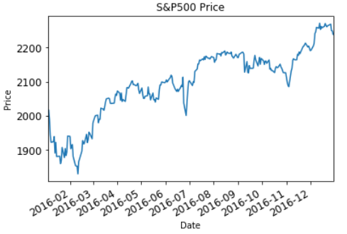
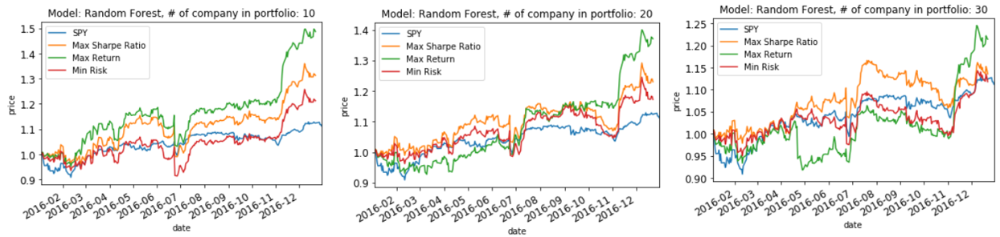

# Portfolio Management

This is a final project for Udacity machine learning nanodegree

# Project Overview

In this project, we will use tradition machine learning techniques(i.e. SVM)
to construct market(i.e. S&P500) beating stock-portfolio. 

# Result

Below is result of our portfolio vs S&P500 index

Refer to "capstone_project.pdf" for more details
